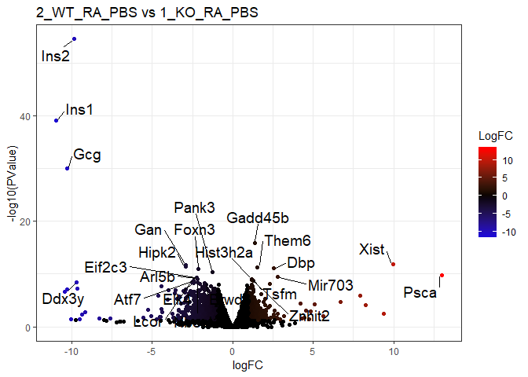
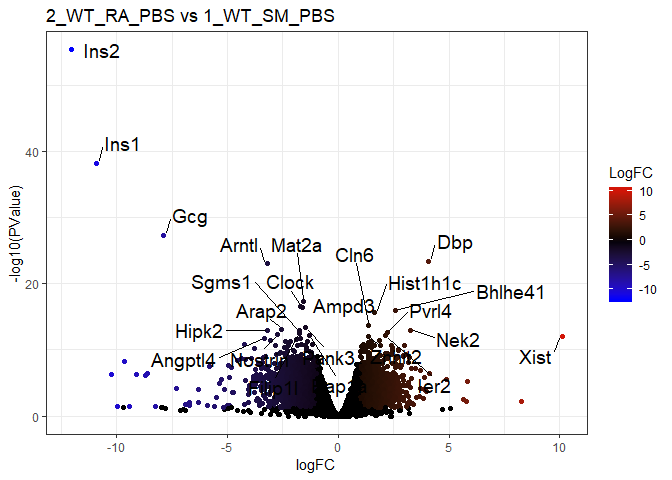
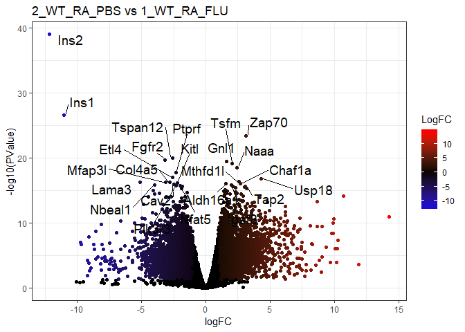

RNA-seq MMP13 Smoke Flu
================
Rui Xiao
May 3, 2019

  - [Read the raw count-table and sample annotation
    files](#read-the-raw-count-table-and-sample-annotation-files)
  - [Preprocess the input data](#preprocess-the-input-data)
  - [Principal Component Analysis](#principal-component-analysis)
  - [Perform pairwise comparisons](#perform-pairwise-comparisons)
  - [Fit generalized linear model](#fit-generalized-linear-model)
      - [Output filtered gene counts and/or their names to console or
        data
        files](#output-filtered-gene-counts-andor-their-names-to-console-or-data-files)
      - [Plot heatmap with top genes found significant for each
        factor](#plot-heatmap-with-top-genes-found-significant-for-each-factor)
      - [Plot significant gene counts of each major factor in a Venn
        diagram](#plot-significant-gene-counts-of-each-major-factor-in-a-venn-diagram)

# Read the raw count-table and sample annotation files

``` r
if (!requireNamespace("BiocManager",quietly=T)) install.packages("BiocManager")
library(BiocManager)

c1=read.table("counts_table_raw.txt",sep="\t",header=T,stringsAsFactors=F,row.names=1)
c2=read.table("counts_table_raw set 2.txt",sep="\t",header=T,stringsAsFactors=F,row.names=1)
c=cbind(c1,c2) # knowing that the row names are matching perfectly
rm(c1,c2) # free memory if no longer needed
dim(c)
```

    ## [1] 23420    24

``` r
head(c) # count table overview
```

    ##        JK001 JK004 JK005 JK011 JK012 JK014 JK017 JK018 JK021 JK022 JK023
    ## Xkr4       2     0     0     0     5     2     1     1     0     0     0
    ## Rp1       76     5    89    81    34   141   100    43    25   248   173
    ## Sox17   1119   912  1169   417  1401   433   554   201   483   355   113
    ## Mrpl15   678   539   586   465   765   395   428   783   612   493   515
    ## Lypla1  1434   969  1378   963  1746   856   719  1280  1200  1190  1173
    ## Tcea1    877   866   785   688   938   593   685   739   692   772   817
    ##        JK028 JK031 JK036 JK039 JK040 JK215 JK217 JK218 JK219 JK228 JK229
    ## Xkr4       5     0     0     0     0    15     7     5    10     9    11
    ## Rp1       18   106   131     2     4   154   305    56   122    20    31
    ## Sox17    427   440   612   327   616  2046  2288  1202  1614   675   663
    ## Mrpl15  1110   489   428  1160   998   926  1180   522   943  1101   968
    ## Lypla1  1788  1110   931  1270  1145  2791  3623  1494  2783  2574  2407
    ## Tcea1   1196   813   654  1051   857  1773  2519  1132  1853  1705  1694
    ##        JK230 JK231
    ## Xkr4       5    15
    ## Rp1      162    99
    ## Sox17   1514   982
    ## Mrpl15  1000   717
    ## Lypla1  2974  2216
    ## Tcea1   1841  1354

``` r
a=read.csv("SampleAnnotation2Batches.csv",header=T,stringsAsFactors=F,row.names=1)
a$SingleFactor=paste(a$Batch,a$MMP13,a$SMOKE,a$FLU,sep="_") # merge factors into one for some further analysis
a$Batch=factor(a$Batch,levels=c(1,2))
a$MMP13=factor(a$MMP13,levels=c("WT","KO"))
a$FLU=factor(a$FLU,levels=c("PBS","FLU"))
a$SMOKE=factor(a$SMOKE,levels=c("RA","SM"))
head(a) # sample annotation overview
```

    ##       Batch MMP13 SMOKE FLU       DOB  SAC_DATE SingleFactor
    ## JK001     1    KO    RA PBS 2/27/2017 6/26/2017  1_KO_RA_PBS
    ## JK004     1    KO    RA PBS 2/27/2017 6/26/2017  1_KO_RA_PBS
    ## JK005     1    KO    RA PBS 2/27/2017 6/26/2017  1_KO_RA_PBS
    ## JK011     1    WT    SM PBS 2/27/2017 6/29/2017  1_WT_SM_PBS
    ## JK012     1    KO    RA FLU 2/27/2017 6/30/2017  1_KO_RA_FLU
    ## JK014     1    WT    SM PBS 2/27/2017 6/29/2017  1_WT_SM_PBS

# Preprocess the input data

``` r
if (!require("edgeR",quietly=T)) BiocManager::install("edgeR")
library(edgeR)
y=DGEList(counts=c,samples=a,group=a$SingleFactor)
keep <- rowSums(cpm(y)>1) >= 2
y <- y[keep, , keep.lib.sizes=FALSE]
y <- calcNormFactors(y)
head(y$samples[,2:3])
```

    ##       lib.size norm.factors
    ## JK001 20100075    0.9927551
    ## JK004 13444148    0.9744933
    ## JK005 19755033    1.0433833
    ## JK011 17655062    0.9687881
    ## JK012 21767921    1.0802167
    ## JK014 14472144    1.0178222

``` r
logcpm <- cpm(y, prior.count=2, log=TRUE)
logfile="logcpm.csv"
if (!file.exists(logfile)) write.csv(logcpm,logfile)

ifSig=function(logFC,P){ # P = PValue or FDR
   return(abs(logFC)>=1&P<0.05)
   # return(abs(logFC)>=0.5849&P<0.1)
}
# setwd("2018 results") # allow results to be written into the subfolder

if (!require("ggplot2")) install.packages("ggplot2")
library(ggplot2)
```

# Principal Component Analysis

``` r
if (!require("FactoMineR",quietly=T)) install.packages("FactoMineR")
library(FactoMineR)
al=cbind(a,t(logcpm))
colnames(al)[1:10] # annotaion goes from 1st to 7th column
```

    ##  [1] "Batch"        "MMP13"        "SMOKE"        "FLU"         
    ##  [5] "DOB"          "SAC_DATE"     "SingleFactor" "Rp1"         
    ##  [9] "Sox17"        "Mrpl15"

``` r
# multiple factors
m.pca=PCA(al[,-c(5:7)],scale.unit=T,ncp=5,quali.sup=1:4,graph=F)
plotellipses(m.pca)
```

<!-- -->

``` r
# single factor
s.pca=PCA(al[,-c(1:6)],scale.unit=T,ncp=5,quali.sup=1,graph=F)
# plot.PCA(s.pca,axes=c(1,2),choix="ind",habillage = 1)
plotellipses(s.pca)
```

<!-- -->

# Perform pairwise comparisons

``` r
if (!require("dplyr",quietly=T)) install.packages("dplyr")
library(dplyr) # %>%, filter, ...
if (!require("tibble",quietly=T)) install.packages("tibble")
library(tibble) # rownames_to_column('gene') column_to_rownames('gene')
if (!require("ggrepel")) install.packages("ggrepel")
library(ggrepel) # dodge labels for ggplot2
y1 <- estimateDisp(y,model.matrix(~SingleFactor,data=a))
pairs <- rbind(  #  c("A","B") = B - A
      c("2_WT_RA_PBS","1_KO_RA_PBS"), # MMP13
      c("2_WT_RA_PBS","1_WT_SM_PBS"), # Smoke
      c("2_WT_RA_PBS","1_WT_RA_FLU") # Flu
) 
for (r in 1:nrow(pairs)) {
   title=paste(pairs[r,],collapse=" vs ")
   tt=topTags(exactTest(y1, pairs[r,]),n=9999999,sort.by="none") # select all with original order
   # write.csv(tt,paste0("Pair_",title,".csv")) # save to local file
   
   tt$table$LogFC=with(tt$table,ifelse(ifSig(logFC,PValue),logFC,0))
   p = ggplot(tt$table,aes(logFC,-log10(PValue)))+
      geom_point(aes(col=LogFC))+
      scale_colour_gradient2(low="blue",mid="black",high="red")+
      labs(title=title)+theme_bw()
   # p
   tt_filter_sort_top=(tt$table %>%
                     rownames_to_column('gene') %>%
                     filter(LogFC!=0) %>%
                     arrange(FDR)  %>%
                     column_to_rownames('gene'))[1:24,] # top_n() may need to ungroup
   print(
      p+geom_text_repel(
         data=tt_filter_sort_top,
         aes(label=row.names(tt_filter_sort_top)),size=5,
         box.padding = unit(0.35, "lines"),point.padding = unit(0.3, "lines")
      )
   )
}
```

<!-- --><!-- --><!-- -->

# Fit generalized linear model

``` r
# design=model.matrix(~MMP13+SMOKE+FLU,data=a)
# design=model.matrix(~MMP13*SMOKE*FLU,data=a)
 design=model.matrix(~MMP13*SMOKE*FLU+Batch,data=a)
# design=model.matrix(~MMP13*SMOKE*FLU*Batch,data=a); design=design[,-c(13:16)]
y2 <- estimateDisp(y,design)
fit <- glmQLFit(y2, design)

allList=function(cf){ # select complete unordered test result regarding each coefficient
   dt=as.data.frame(topTags(glmQLFTest(fit,coef=cf),n=999999,sort.by="none"))
   colnames(dt)=paste0(colnames(design)[cf],"_",colnames(dt))
   return(dt)
}
# write.csv(cbind(allList(2),allList(3),allList(4),allList(5),allList(6),allList(7),allList(8)),"GLM_All.csv") # combine and write to csv file
```

## Output filtered gene counts and/or their names to console or data files

``` r
# functions that select stats on each factor
filterCount=function(cf){
   cat(paste0(colnames(design)[cf]," Counts:\n"))
   return(nrow(subset(as.data.frame(topTags(glmQLFTest(fit, coef=cf),n=999999)),ifSig(logFC,FDR))))
}
filterTop=function(cf,top=24){
   cat(paste0(colnames(design)[cf]," top",top," :\n"))
   return(topTags(glmQLFTest(fit, coef=cf),n=top))
}
filterName=function(cf){
   cat(paste0(colnames(design)[cf]," Name:\n"))
   return(row.names(subset(as.data.frame(topTags(glmQLFTest(fit, coef=cf),n=999999)),ifSig(logFC,FDR))))
   
}
filterWrite=function(cf){
   cat(paste0(colnames(design)[cf]," written to file:\n"))
   write.csv(subset(as.data.frame(topTags(glmQLFTest(fit, coef=cf),n=999999)),ifSig(logFC,FDR)),
             paste0("",gsub(":","+",colnames(design)[cf]),".csv"))
}

for (i in 2:ncol(design)){ # uncomment following lines to enable the outputs
   cat(filterCount(i),end="\n")
   # print(filterTop(i))
   # print(filterName(i))
   # filterWrite(i)
}
```

    ## MMP13KO Counts:
    ## 1 
    ## SMOKESM Counts:
    ## 0 
    ## FLUFLU Counts:
    ## 510 
    ## Batch2 Counts:
    ## 1674 
    ## MMP13KO:SMOKESM Counts:
    ## 0 
    ## MMP13KO:FLUFLU Counts:
    ## 3 
    ## SMOKESM:FLUFLU Counts:
    ## 0 
    ## MMP13KO:SMOKESM:FLUFLU Counts:
    ## 2

## Plot heatmap with top genes found significant for each factor

``` r
if (!require("pheatmap",quietly=T)) install.packages("pheatmap")
library(pheatmap)

order=a[order(a$Batch,a$MMP13,a$SMOKE,a$FLU),] # ordered annotation
logcpm=logcpm[,row.names(order)] # ordered logcpm

plotPheatmap=function(cf,clus_col=T,pdf=T){
   d=as.data.frame(logcpm[row.names(filterTop(cf)),])
   outfile=gsub(":","+",paste("heatmap","coef",i,colnames(design)[i],filterCount(cf),sep="_"))
   if (pdf) pdf(paste0(outfile,".pdf"),width=9,height=6)
   pheatmap(d,scale="row",annotation_col=order[,1:4],cluster_cols=clus_col,main=outfile)
   if (pdf) dev.off()
}
for (i in 2:ncol(design)){
   plotPheatmap(i,pdf=F)
}
```

    ## MMP13KO top24 :
    ## MMP13KO Counts:

<!-- -->

    ## SMOKESM top24 :
    ## SMOKESM Counts:

<!-- -->

    ## FLUFLU top24 :
    ## FLUFLU Counts:

<!-- -->

    ## Batch2 top24 :
    ## Batch2 Counts:

<!-- -->

    ## MMP13KO:SMOKESM top24 :
    ## MMP13KO:SMOKESM Counts:

<!-- -->

    ## MMP13KO:FLUFLU top24 :
    ## MMP13KO:FLUFLU Counts:

<!-- -->

    ## SMOKESM:FLUFLU top24 :
    ## SMOKESM:FLUFLU Counts:

<!-- -->

    ## MMP13KO:SMOKESM:FLUFLU top24 :
    ## MMP13KO:SMOKESM:FLUFLU Counts:

<!-- -->

## Plot significant gene counts of each major factor in a Venn diagram

``` r
if (!require("systemPipeR",quietly=T)) BiocManager::install("systemPipeR")
library(systemPipeR)

setlist=list(MMP13=row.names(topTags(glmQLFTest(fit, coef=2),p.value=0.05,n=999999)),
           Smoke=row.names(topTags(glmQLFTest(fit, coef=3),p.value=0.05,n=999999)),
           Flu=row.names(topTags(glmQLFTest(fit, coef=4),p.value=0.05,n=999999)))
vennPlot(overLapper(setlist,type="vennsets"))
```

<!-- -->

``` r
setlist=list(MMP13=row.names(topTags(glmQLFTest(fit, coef=2),p.value=0.05,n=999999)),
           Smoke=row.names(topTags(glmQLFTest(fit, coef=3),p.value=0.05,n=999999)),
           Flu=row.names(topTags(glmQLFTest(fit, coef=4),p.value=0.05,n=999999)),
           Batch=row.names(topTags(glmQLFTest(fit, coef=5),p.value=0.05,n=999999)))
vennPlot(overLapper(setlist,type="vennsets"))
```

<!-- -->

Data credits: Jeanine D’Armiento, Monica Goldklang, Kyle Stearns;
Columbia University Medical Center
